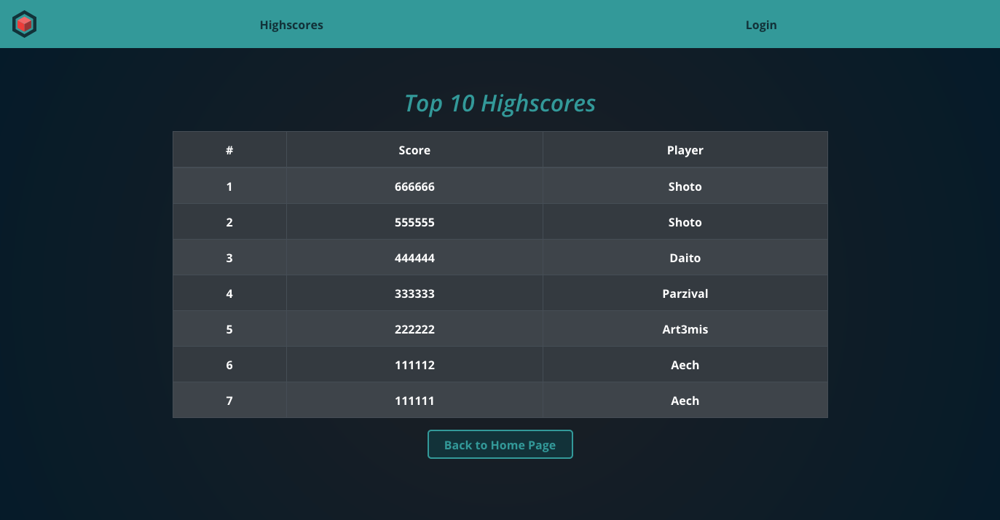

# nFocus - A nBack based game

## Introduction

nFocus is a memory game based on the Double [n-Back](https://en.wikipedia.org/wiki/n-back) performance task where the player is exposed in each round to a Visual and an Auditory stimulus at the same time. During each round, the player shall identify if one or both of these stimuli appeared in a n quantity of rounds before.
The objective of nFocus is to provide the player an opportunity to use its concentration capacity, its [Working Memory](https://en.wikipedia.org/wiki/Working_memory) and [Fluid Intelligence](https://en.wikipedia.org/wiki/Fluid_and_crystallized_intelligence) through a playful and competitive experience.

## Table of Contents

- [App Demo](#app-demo)
- [Backend Repository](#backend-repository)
- [Used Technologies](#used-technologies)
- [Goals for this Project](#goals-for-this-project)
- [User Stories](#user-stories)
- [Wireframe](#wireframe)
- [Data Model](#data-model)
- [Concept](#concept)
- [Interface](#interface)
- [Audience](#audience)
- [Bibliography](#bibliography)

## App Demo

### You can see a working version 1.0 [here](https://nfocus.netlify.app/)

## Backend Repository

### You can see the backend repo [here](https://github.com/sdbb21/nfocus-server)

## Used Technologies

- React
- Redux
- React Bootstrap
- CSS Animations
- SVG graphics
- Howler
- Lodash
- Axios
- Express
- Sequelize

## Goals for this Project

This project's main goal is to combine my Game Design and Graphic Design experience with the recently acquired knowledge at Codaisseur.

- Create a game with React
- Solving the _out-of-scope_ shortcommings of React by researching
- Implementing Sound as a new technology
- Showcasing my set of skills
- Practicing the new knowledge

## User Stories

As a User,

- I want to use my mind: nFocus will use your memory, focus and attention capacity.

- I want to see my progress: By creating a user account and login in, your score will be saved every time you play.

- I want to compare to other Users: Check your position and best score in the players' Top 10.

- I want to relax and concentrate: Its minimalist design and melodic sounds make nFocus a meditation-like experience.

## Wireframe

## Data Model

---

## Concept

The concept of nFocus was inspired by one the side effects suffered by social groups that live the day by day in a cultural convergence. These groups (in which I include myself) are able to perform several tasks at the same time in different mediums simultaneously thanks to their ability to “anchor” and “de-anchor” their attention easily. Although this is a desirable competence, by adding the stimulus overload to which we are exposed today (Visual and Auditory) we have decreased the duration of the [Attention Span](https://en.wikipedia.org/wiki/Attention_span) and also the ability to select and block external stimuli to our focal objective of the moment. [Some](http://youtu.be/y0hY5TYVv_s?t=5m10s) call this effect Acquired Attention Deficit Hyperactivity Disorder (AADHD).
Considering myself a “victim” of this effect, I decided to investigate more on the subject and on methods that could help reduce this disorder, such as, for example, the [n-Back](https://en.wikipedia.org/wiki/N-back) exercise (Wayne Kirchner, 1958) and its audiovisual variant Dual n- Back (Susanne Jaeggi and company, 2003).
In the exercise we see a figure on the screen in a certain position and we hear a sound, in this case a letter. In each series we must remember the position and sound **n number of series back** and compare them with the current one. If we find that one or both of them are repeated, we must indicate it by pressing the corresponding buttons on the screen. _See below:_

A [published study](http://www.pnas.org/content/early/2008/04/25/0801268105.full.pdf) by Jaeggi _et al._ shows that this exercise _could potentially_ improve [Working Memory](https://en.wikipedia.org/wiki/Working_memory) and [Fluid Intelligence](https://en.wikipedia.org/wiki/Fluid_and_crystallized_intelligence).
So I decided to test the [Brain Workshop](http://brainworkshop.sourceforge.net/download.html) app. Although it is a replica of the original Jaeggi exercise, and it has a variety of options and configurations to adapt it to the user's taste and ability, its interface is concise and unfriendly, something that would definitely scare off the audience that I propose as a target.

## Interface

With this and the aforementioned stimulus overload in mind, I opted for a simple, minimalist interface with the minimum UI elements in sight, which helps the player to focus on the task without being distracted during the course of each level. For this I took inspiration from games with minimalist aesthetics such as Lyne and Rymdkapsel.
As an aid to stay focused, in addition to the visual aspect, as a rule players must restart the level if they interrupt the game for any reason.
Where Brain Workshop fails to keep the user “hooked”, **nFocus** takes elements of casual games (simplicity and competition) and combines them with gameplay that requires their full attention, making it a novel and almost meditative experience.

## Audience

The audience targeted with this game is broad. Due to the simplicity of its presentation and the scalability of its complexity, **nFocus** can attract both adults or teenagers as a challenge or as a tool to counteract the effects of a day-to-day full of stimuli and audiovisual noise.
**nFocus** is a non-violent game and it's devoid of any stereotype, and even so in the future the visual interface could be modified making it more attractive to a younger audience without the need to change the core of the game.

## Bibliography

### Concepts

- Working Memory: (https://en.wikipedia.org/wiki/Working_memory)
- Fluid Intelligence(https://en.wikipedia.org/wiki/Fluid_and_crystallized_intelligence)
- Test N-Back: (https://en.wikipedia.org/wiki/n-back)
- Attention Span:(https://en.wikipedia.org/wiki/Attention_span)

### Articles & Talks

- Siggelakis, Theo (2014) _Living with ADHD in the age of information and social media._ TEDxQuinnipiacU, Connecticut, USA. [Video](http://youtu.be/y0hY5TYVv_s)
- Jaeggi, Buschkuehl, Jonides y Perrig (2008) _Improving fluid intelligence with training on working memory._ PNAS, USA. (www.pnas.org/content/early/2008/04/25/0801268105.full.pdf)
- Cánovas, Guillermo (2015) _“Mamá: no puedo parar los pensamientos que me llegan a la cabeza”._ Kids and Teens Online Blog, Spain. (kidsandteensonline.com/2015/02/24/mama-no-puedo-parar-los-pensamientos-que-me-llegan-a-la-cabeza/)
- Foster, Douglas (2013) _How to Rebuild an Attention Span._ The Atlantic, USA. (www.theatlantic.com/health/archive/2013/09/how-to-rebuild-an-attention-span/279326/)
- Koster, Ralph (2013) _A Theory of Fun for Game Design (2nd Edition)._ O’Reilly, USA. (http://www.theoryoffun.com/)
